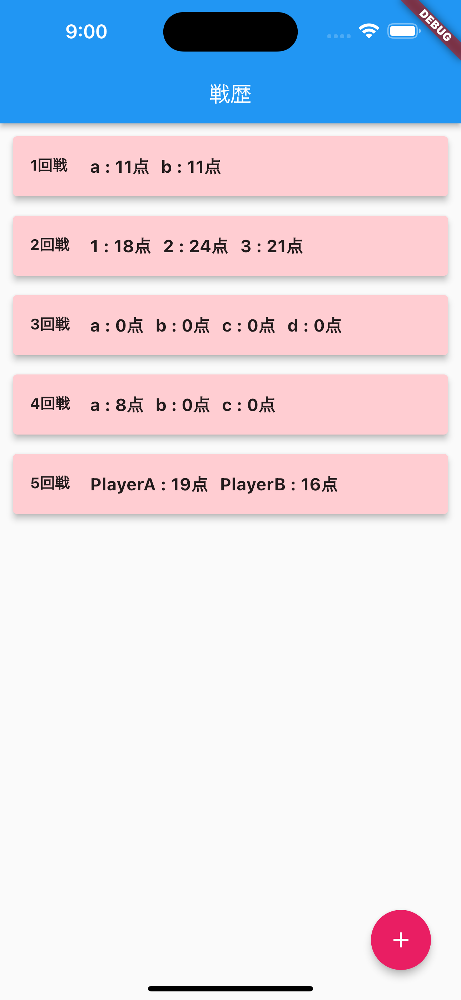
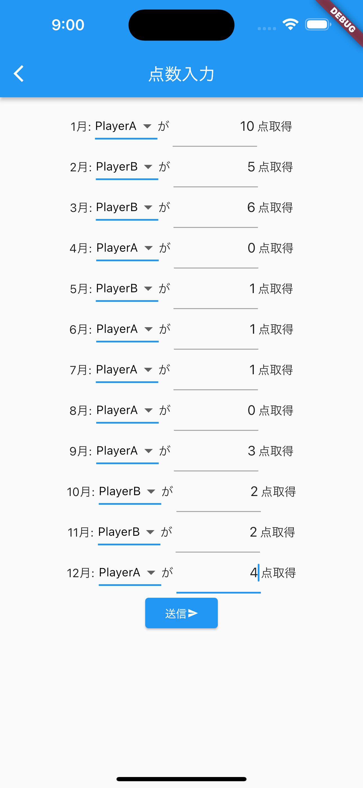
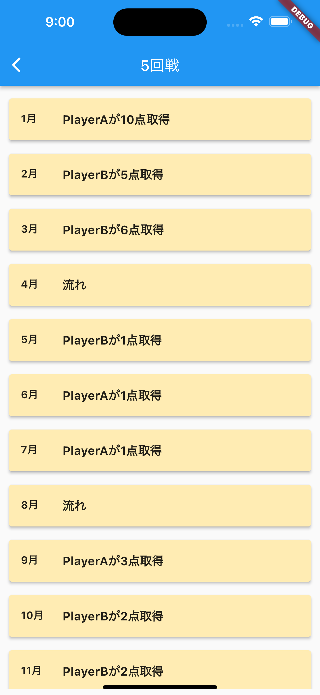

# 花札戦歴記録アプリケーション

私が花札にハマり友人と遊ぶ事が増えたのだが、点数を記録するアプリが無く点数を覚えておく必要があった為、点数を記録できるアプリケーションを作成した。

## デモ

- ホーム画面でこれまでの対戦記録を確認する事ができる。

- ホーム画面の右下にあるボタンをクリックすると参加メンバーを入力するフォームが現れる。
- フォームに2名以上の名前を入力し、「登録」ボタンを押すとメンバーが登録される。
- 必須フォームに入力が無い場合や、同じ名前が入力された場合には「登録」ボタンを押しても登録されないようにしている。

- 実際に花札を遊び、1月から12月までの点数を記録する。
- 事前に登録したメンバー名を使用してプルダウンメニューを作成し、誰が何点取ったのかを記録できる。
- 1月から12月まで入力し、「送信」ボタンを押すとデータベースへ記録される。

- ホーム画面のリストをタップすると詳細画面に遷移する。
- 何月に誰が何点取ったのかを知る事ができる。

## 学んだこと

- SQLiteを利用してデータを保存・参照する方法
- プルダウンメニューの作成方法など
